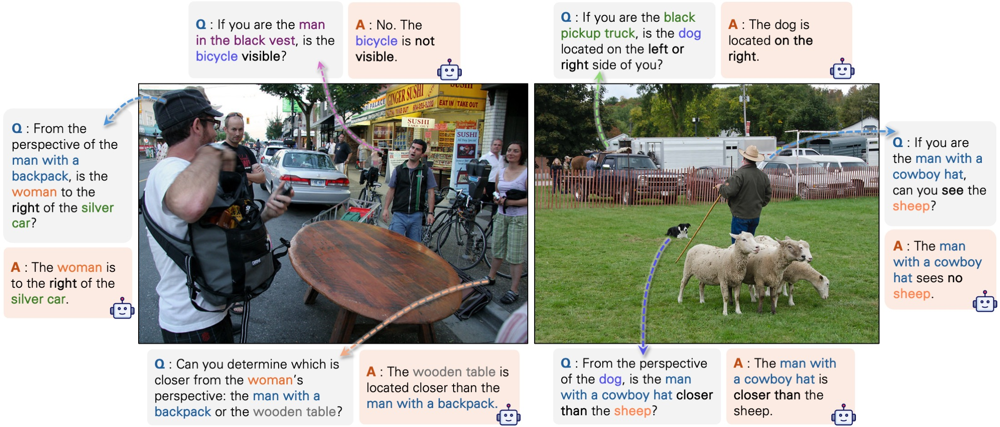

# Perspective-Aware Reasoning in Vision-Language Models via Mental Imagery Simulation

<!-- Title image -->

  

<!-- Badges -->

  
  

### 💡 Abstract

> We present a framework for perspective-aware reasoning in vision-language models (VLMs) through mental imagery simulation. Perspective-taking&mdash;the ability to perceive an environment or situation from an alternative viewpoint&mdash;is a key benchmark for human-level visual understanding, essential for environmental interaction and collaboration with autonomous agents. Despite advancements in spatial reasoning within VLMs, recent research has shown that modern VLMs significantly lack perspective-aware reasoning capabilities and exhibit a strong bias toward egocentric interpretations. To bridge the gap between VLMs and human perception, we focus on the role of mental imagery, where humans perceive the world through abstracted representations that facilitate perspective shifts. Motivated by this, we propose a framework for perspective-aware reasoning, named Abstract Perspective Change (APC), that effectively leverages vision foundation models, such as object detection, segmentation, and orientation estimation, to construct scene abstractions and enable perspective transformations. Our experiments on synthetic and real-image benchmarks, compared with various VLMs, demonstrate significant improvements in perspective-aware reasoning with our framework, further outperforming fine-tuned spatial reasoning models and novel-view-synthesis-based approaches.

### 🚀 Code: Coming Soon!